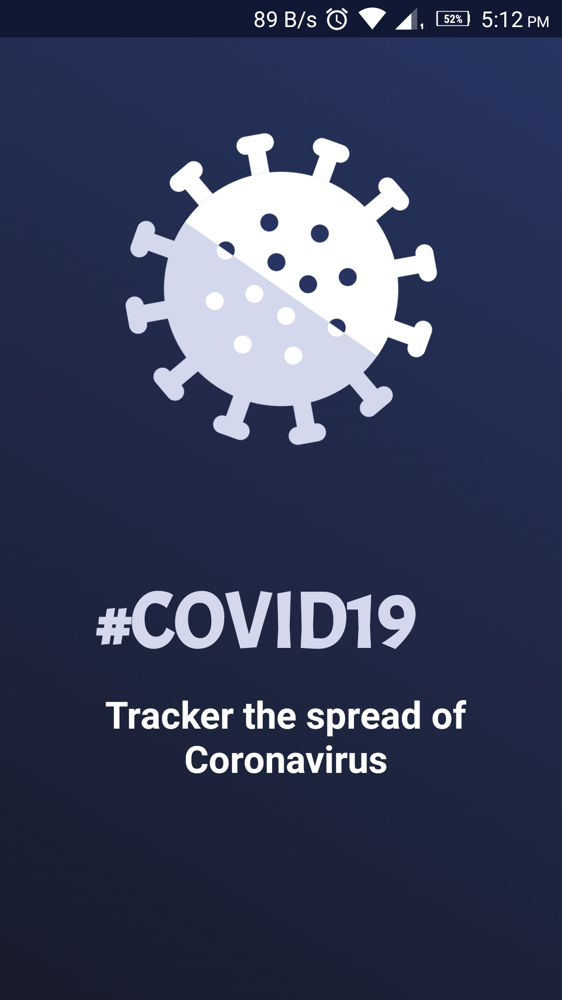
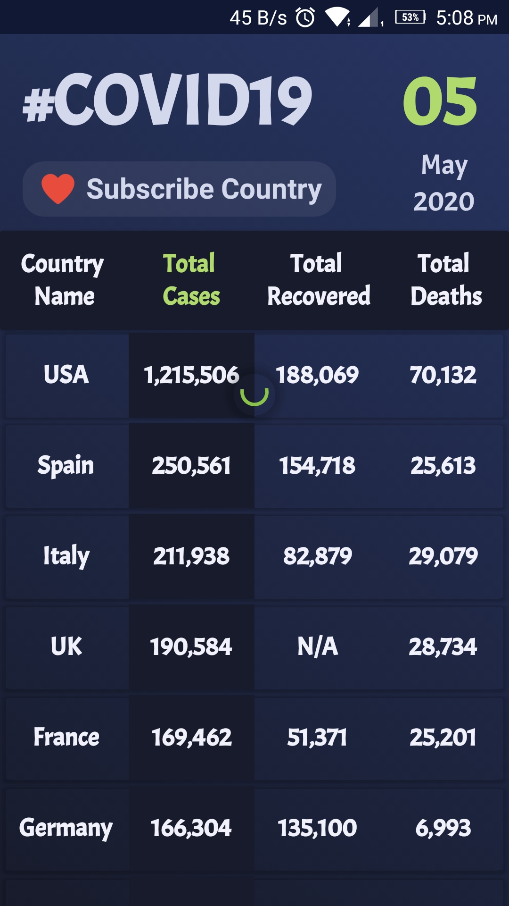
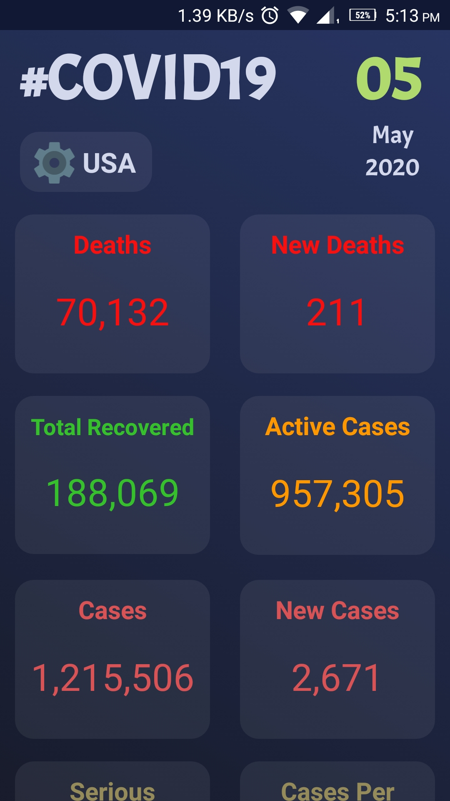
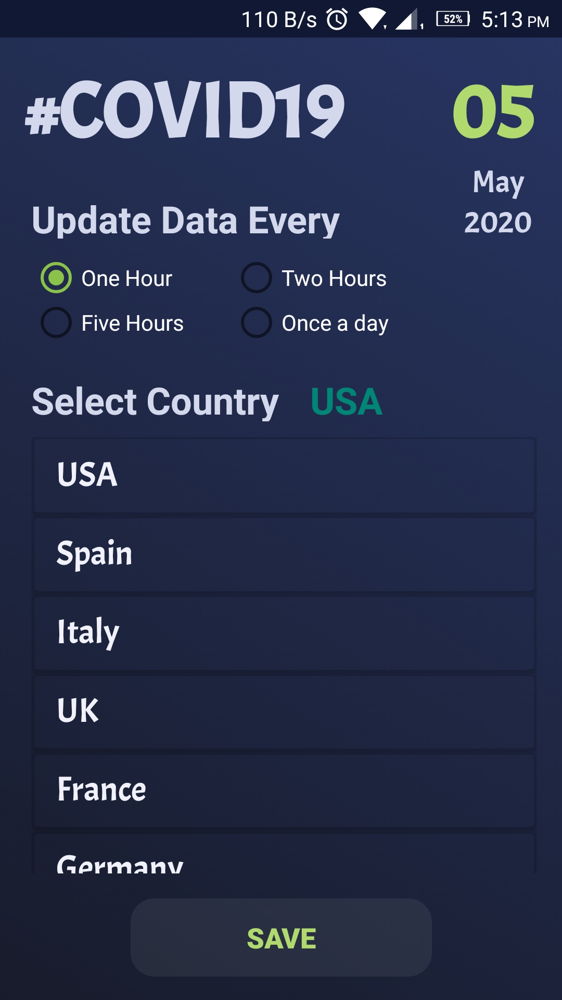
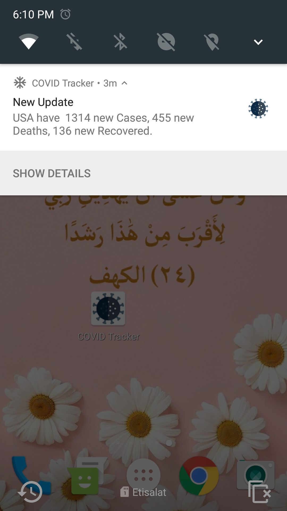
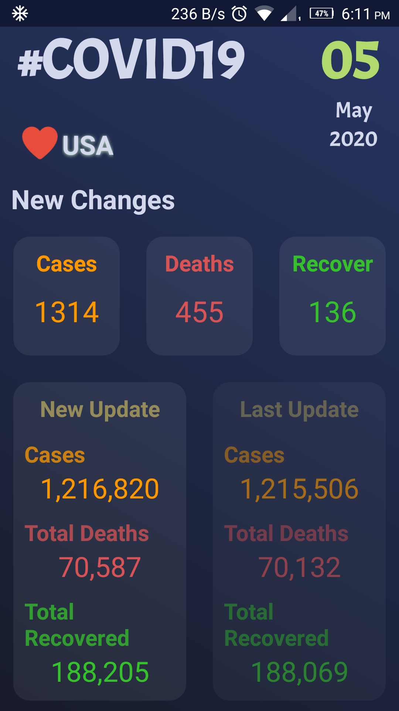
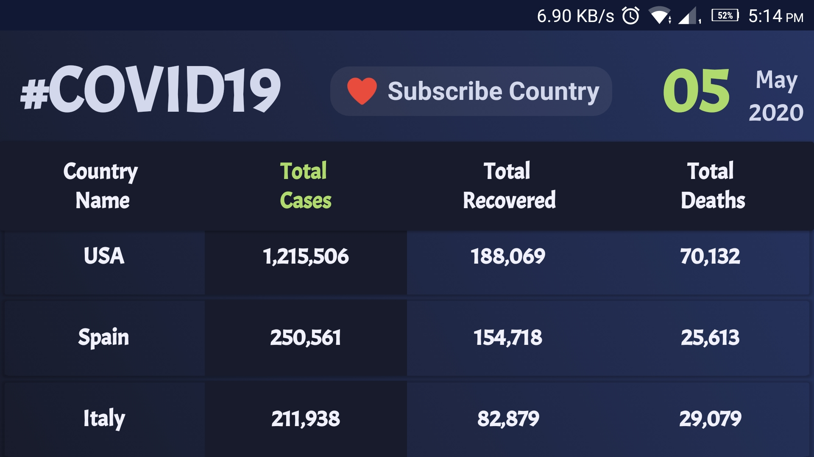
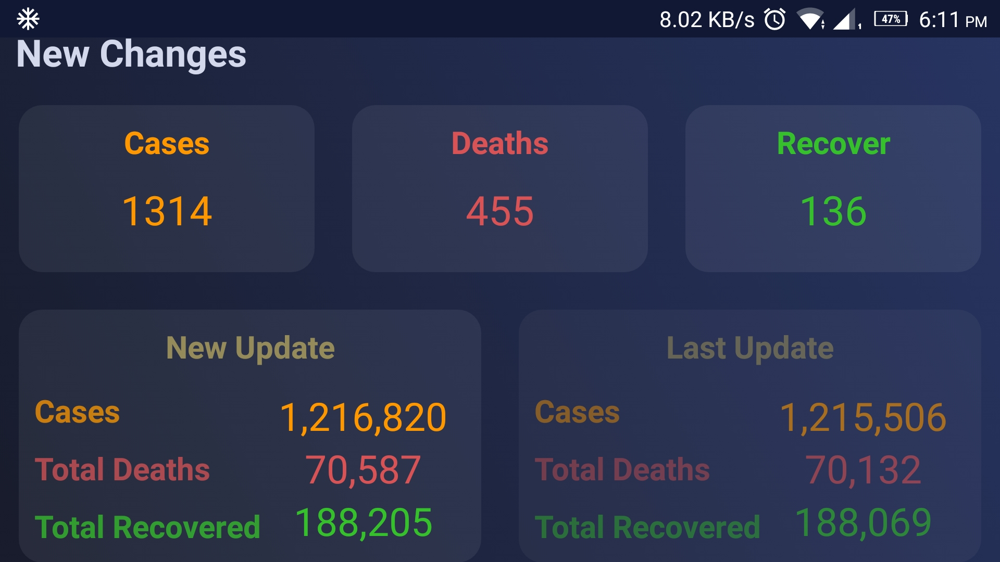

# COVIDTracker

COVIDTracker is a mobile application that displays real-time data about the cases of COVID-19. 
COVIDTracker shows worldwide data of confirmed, recovered and death cases for all countries.   
User can also get country-wise data. 
User can subscribe on one country and get notification regarding any data changes (change in
confirmed, recovered or death cases). 
User can click on notification to get more details about the new changes.   

Get the data from: [Coronavirus Monitor API](https://rapidapi.com/astsiatsko/api/coronavirus-monitor)

## Using Tools:

- **Kotlin** version: 1.3.50
- **MVVM Design Patterns**
- **Coroutines** version: 1.2.1
- **Retrofit** version: 2.8.1
- **Room** version: 1.1.1
- **LiveData** version: 1.1.1
- **WorkManager** version: 2.3.4
- **SwiperefreshLayout** version: 1.0.0
- **Notifications**

## Screenshot:

              
           
       
     
     
                
     
                                                                                                        
                  
    

